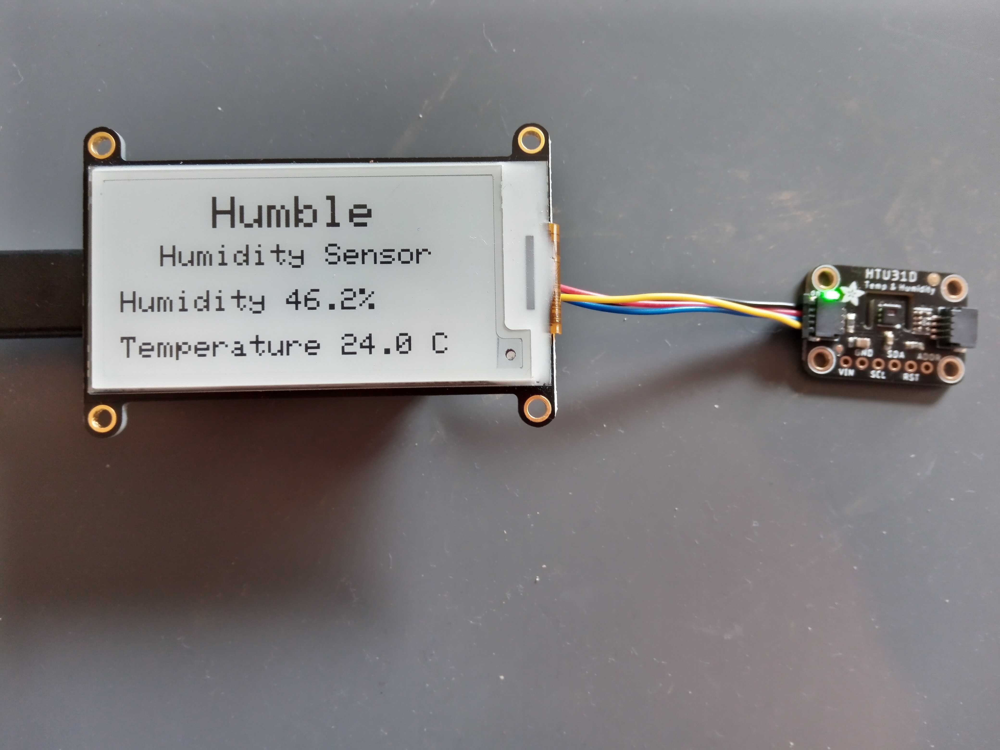

= Humidity Sensor CircuitPython
Jordan Williams <jordan@jwillikers.com>
:experimental:
:icons: font
ifdef::env-github[]
:tip-caption: :bulb:
:note-caption: :information_source:
:important-caption: :heavy_exclamation_mark:
:caution-caption: :fire:
:warning-caption: :warning:
endif::[]
:Adafruit-Feather-RP2040: https://learn.adafruit.com/adafruit-feather-rp2040-pico[Adafruit Feather RP2040]
:CircuitPython: https://circuitpython.org/[CircuitPython]

image:https://img.shields.io/github/workflow/status/jwillikers/humidity-sensor-circuitpython/CI[GitHub Workflow Status]

// todo Port to C++ and eventually Rust.

A simple humidity sensor using the {Adafruit-Feather-RP2040}, monochrome eInk Display FeatherWing, and HTU31D humidity sensor, written in {CircuitPython}.

ifdef::env-github[]
++++

  

  

++++
endif::[]

ifndef::env-github[]

image::pics/Humidity Sensor Demo.gif[Humidity Sensor Demo, align=center]
endif::[]

== Hardware

The hardware components comprising the humidity sensory are listed below.

.Humidity Sensor Components
* https://www.adafruit.com/product/4195[Adafruit 2.13" Monochrome eInk / ePaper Display FeatherWing - 250x122 Monochrome with SSD1680]
* https://www.adafruit.com/product/4884[Adafruit RP2040 Feather]
* https://www.adafruit.com/product/1570[Lithium Ion Polymer Battery - 3.7v 100mAh]
* https://www.adafruit.com/product/4832[HTU31D Humidity Sensor]
* https://www.adafruit.com/product/2830[Stacking Headers for Feather - 12-pin and 16-pin female headers]
* https://www.adafruit.com/product/4399[STEMMA QT / Qwiic JST SH 4-Pin Cable - 50mm Long]

Programming will require a USB-C cable and a computer.

== How it Works

The humidity sensor samples the relative humidity and temperature once every second.
After five minutes, it finds the median of these values and updates the readings shown on the display.
A median is simple and accounts for outliers, making the displayed readings more consistent than one-off samples.
When the humidity sensor starts up, it immediately displays the value of a single reading from sensor.
This avoids undue delays for users.

== Shortcomings

Efficiency::
The battery life is abysmal.
The 105 mAh battery fails to sustain this power-hungry machine for more than several hours.
I'm hoping to get closer to a week's worth of life out of a single battery life.
Improvements to energy efficiency include the following.
+
.Power Optimizations
- [ ] Store sensor readings with Direct Memory Access, aka _DMA_, to avoid waking the microcontroller as frequently.
Unfortunately, I don't believe this functionality is available in CircuitPython at this time.
- [ ] Put the RP2040 into deep sleep, waking only to refresh the screen.
If values must be stored in non-volatile memory, consider using an FRAM breakout instead of the onboard EEPROM.
- [ ] Increase the interval between updates of the screen.
- [ ] Cut the line to the LED on the humidity sensor breakout.

Deployment::
The compiled `.mpy` files deployed using the `deploy.fish` script may be out-of-date and incompatible with the target CircuitPython version.
It would probably be best to just build these from source for the target version.
Deployment also copies unnecessary EPD drivers to the Feather RP2040.
The deploy script should be improved by adding functions and additional support for installing only the necessary libraries.

== Getting Started

The instructions here setup the software for the Feather RP2040.
It is assumed that you are on and familiar with Linux and using CircuitPython on microcontrollers.
Fedora Silverblue 34 is used as the reference operating system and the shell used is fish.

[TIP]
====
To access the serial connection to the Feather RP2040 without requiring superuser privileges, add your user to the `dialout` group.

[source,sh]
----
sudo usermod -a -G dialout $USER
----

Now restart for the change to take effect.
====

. First, configure the RP2040 Feather for CircuitPython by installing the latest U2F bootloader, at least version 7.0.0-alpha.4.
The CircuitPython bootloader for the Feather RP2040 is available on the https://circuitpython.org/board/adafruit_feather_rp2040/[CircuitPython Adafruit Feather RP2040 page].
+
[source,sh]
----
wget -qLP ~/Downloads https://downloads.circuitpython.org/bin/adafruit_feather_rp2040/en_US/adafruit-circuitpython-adafruit_feather_rp2040-en_US-7.0.0-alpha.4.uf2
----

. Hold down the button marked _bootsel_ on the Feather RP2040 while plugging it in to your computer with a USB-C cable.
The RP2040 should automatically be mounted as a disk on your computer.
In my case, it has been mounted at `/run/media/jordan/RPI-RP2`.
The lsblk command can be used to find where it has been mounted
+
[source,sh]
----
lsblk
----

. Now copy over the U2F bootloader to the RP2040.
+
[source,sh]
----
cp ~/Downloads/adafruit-circuitpython-adafruit_feather_rp2040-en_US-7.0.0-alpha.4.uf2 /run/media/$USER/RPI-RP2
----

. Wait for the file to finish copying, after which the Feather RP2040's onboard storage should automatically be mounted.
This is mounted at `/run/media/jordan/CIRCUITPY` on my machine.

. Clone this project's repository.
+
[source,sh]
----
git -C ~/Projects clone https://github.com/jwillikers/humidity-sensor-circuitpython.git
----

. Use the `deploy.fish` shell script to download and install necessary dependencies and the `code.py` source code file to the Feather RP2040.
+
[source,sh]
----
~/Projects/humidity-sensor-circuitpython/deploy.fish
----

. Eject the Feather RP2040 from the computer when you're ready to remove it from your computer.
+
[source,sh]
----
udisksctl unmount -b (findmnt -n -o SOURCE --target /run/media/$USER/CIRCUITPY)
----

== Development

It's recommended to create a virtual environment for the project and to use the provided {pre-commit} checks when developing.

. Create a virtual environment for the project.
+
[source,sh]
----
python -m venv .env
----

. Activate the virtual environment.
+
[source,sh]
----
source .env/bin/activate.fish
----

. Install the packages available for CPython directly on your computer.
This enables tools and editors to better verify that the libraries are being used properly.
+
[source,sh]
----
pip install -r requirements.txt
----

. Install the development dependencies.
+
[source,sh]
----
pip install -r requirements-dev.txt
----

. Install the Git hooks for pre-commit.
.
+
[source,sh]
----
pre-commit install
----

== Documentation

.CircuitPython Documentation
* https://circuitpython.readthedocs.io/en/latest/shared-bindings/alarm/index.html[alarm]
* https://circuitpython.readthedocs.io/projects/epd/en/latest/[epd]
* https://circuitpython.readthedocs.io/projects/framebuf/en/latest/[framebuf]
* https://circuitpython.readthedocs.io/projects/htu31d/en/latest/[htu31d]
* https://circuitpython.readthedocs.io/en/latest/shared-bindings/neopixel_write/index.html[neopixel_write]

== Contributing

Contributions in the form of issues, feedback, and even pull requests are welcome.
Make sure to adhere to the project's link:CODE_OF_CONDUCT.adoc[Code of Conduct].

== Open Source Software

This project is built on the hard work of countless open source contributors.
Several of these projects are enumerated below.

* https://asciidoctor.org/[Asciidoctor]
* {CircuitPython}
* https://git-scm.com/[Git]
* https://www.linuxfoundation.org/[Linux]
* https://www.python.org/[Python]
* https://rouge.jneen.net/[Rouge]
* https://www.ruby-lang.org/en/[Ruby]

== Code of Conduct

Refer to the project's link:CODE_OF_CONDUCT.adoc[Code of Conduct] for details.

== License

This repository is licensed under the https://www.gnu.org/licenses/gpl-3.0.html[GPLv3], a copy of which is provided link:LICENSE.adoc[here].

© 2021 Jordan Williams

== Authors

mailto:{email}[{author}]
